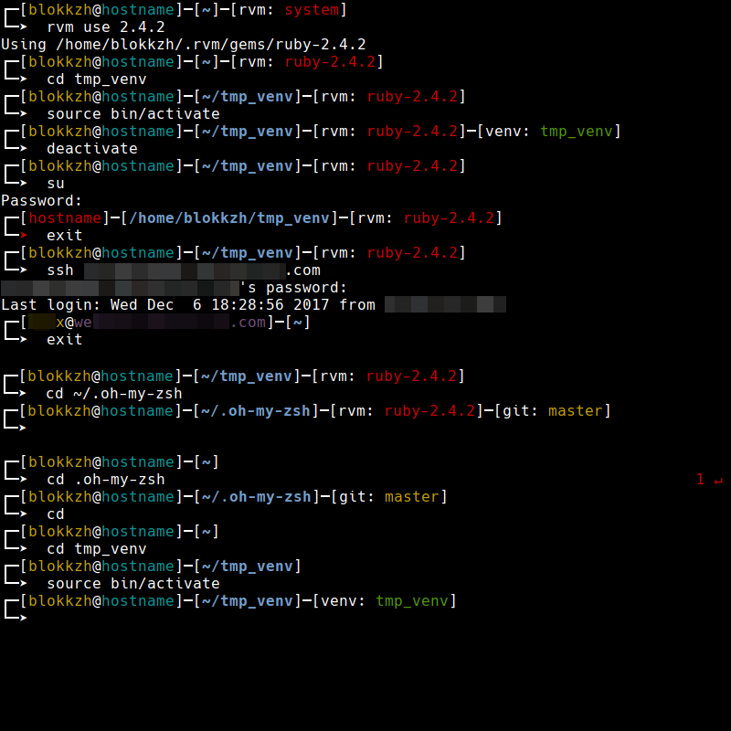
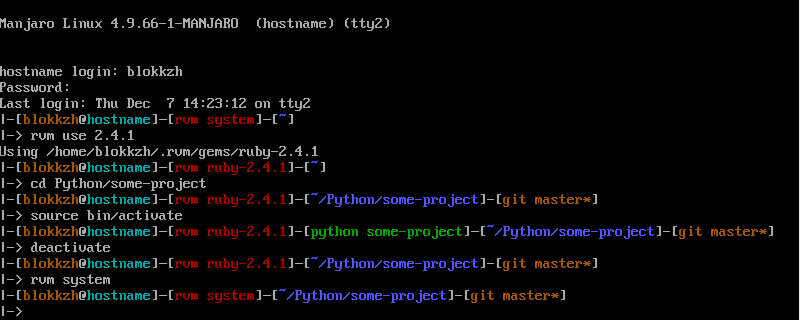

# blokkzh
A theme for robbyrussell's [oh-my-zsh](https://github.com/robbyrussell/oh-my-zsh) based on its built in [gnzh](https://github.com/robbyrussell/oh-my-zsh/blob/master/themes/gnzh.zsh-theme) theme.  
To install, follow [these instructions](https://github.com/robbyrussell/oh-my-zsh/wiki/Customization#overriding-and-adding-themes) and make sure you have a font with Unicode support installed, eg. the Noto font family.  
Or you can execute this command:  
`curl -O https://raw.githubusercontent.com/KorvinSilver/blokkzh/master/blokkzh-downloader.zsh && zsh blokkzh-downloader.zsh $ZSH_CUSTOM && rm blokkzh-downloader.zsh`

#### Screenshots

xterm  

tty  

